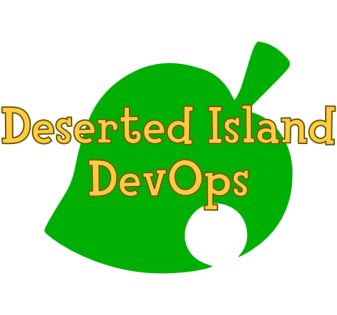

# Deserted Island DevOps Notes

This repo contains my notes from the [Deserted Island DevOps tech conference](https://desertedisland.club) that was streamed on April 30, 2020. Over 7,000 people watched the stream on Twitch and there was a large amount of good conversation in the Twitch chat and the Discord server.

If you're too busy to read through all the notes or watch all the videos, I wrote up a [TL;DR doc](tldr.md).

Feel free to add your own notes or edit mine via PR! The thoughts and initiatives that were shared during the conference absolutely deserve a wide audience. Let's help the world learn!
